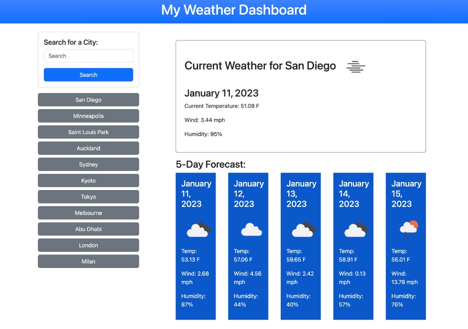

# Weather Dashboard

## Technology Used 

| Technology Used         | Resource URL           | 
| ------------- |:-------------:| 
| HTML    | [https://developer.mozilla.org/en-US/docs/Web/HTML](https://developer.mozilla.org/en-US/docs/Web/HTML) | 
| JavaScript | [https://developer.mozilla.org/en-US/docs/Web/JavaScript](https://developer.mozilla.org/en-US/docs/Web/JavaScript) |
| jQuery | [https://jquery.com/](https://jquery.com/) |
| Bootstrap | [https://getbootstrap.com/](https://getbootstrap.com/) |
| Day.js | [https://day.js.org/](https://day.js.org/) |
| OpenWeather API | [https://openweathermap.org/api](https://openweathermap.org/api) |
| Git | [https://git-scm.com/](https://git-scm.com/)     |    

 

## Description 

[Visit the Deployed Site](https://rmoscoe.github.io/weather-dashboard/)

A user can enter the name of any city in the search field to display the current weather conditions in that city and a five-day forecast. That city is also added to the user's search history, which is saved to local storage. Each city in the search history appears as a button, which shows the current weather and five-day forecast for that city with a single click.

 

 

## Usage 

To use the dashboard, simply enter the name of a city in the search field or click a city from your search history. Do not include a state or country in the search.

 

## Learning Points 

### By completing this project, I got very comfortable using **third-party APIs**, including the ability to glean necessary information from the APIs' documentation. In addition, I improved the following skills:
* Bootstrap
* jQuery

 

## Author Info

### Ryan Moscoe 

* [Portfolio](https://rmoscoe.github.io/portfolio/)
* [LinkedIn](https://www.linkedin.com/in/ryan-moscoe-8652973/)
* [Github](https://github.com/rmoscoe)

 

## License

See repository for license information.